# 3.1.0 猫咪庭院优化说明

日期：2026-10-01　|　版本：3.0.0 → **3.1.0**　|　范围：猫咪庭院（锦鲤池、赶海未改动）

这一版先修你提的三个问题，再把猫咪庭院完整跑了一遍，把跑的过程中发现的不合理之处一起改掉。下面每一项都写清楚：**原来是什么样、为什么会这样、现在怎么做的**，配了前后对比图。

---

## 一览

| # | 问题 | 来源 | 状态 |
|---|---|---|---|
| 1 | 走路时像少了一条前脚（右前脚） | 你提的 | ✅ 已修 |
| 2 | 上下台阶的跳动很奇怪 | 你提的 | ✅ 重绘跳跃动作 |
| 3 | 走到树下被树叶整只盖住，视角不合理 | 你提的 | ✅ 已修 |
| 4 | 猫坐在石阶上，后面要上木廊/回窝/喝水的猫永远排队 | 巡检发现 | ✅ 已修 |
| 5 | 两只猫在窄木廊、窝边互相等，顶牛不动 | 巡检发现 | ✅ 已修 |
| 6 | 玩毛线球、猫抓板、玩具小鼠时背对玩具 | 巡检发现 | ✅ 已修 |
| 7 | 树下的猫点不中 | 巡检发现 | ✅ 已修 |
| 8 | 「减少动态」下跳跃幅度仍是全幅 | 巡检发现 | ✅ 减半 |

---

## 1. 走路像少了一条前脚

**原来**：走路时猫身下画四条独立的腿。远侧那条前腿被放在了身体中段（比近侧前腿往后挪了约四分之一个身长），看起来就像肚子底下多出一条腿、胸前只剩一条前腿。猫朝左走时，它的右前脚正好是这条“远侧前腿”，所以你看到的是“没有右前脚”。另外腿的粗细只有原画的一半左右，英短这类圆胖猫看起来像踩高跷。

**原因**：三分之四视角下，远侧的腿应该在近侧腿的“上方、靠头一侧”（画面里是脸颊下面），原来的偏移方向反了。

**现在**：

- 远侧前腿放到脸颊下方、紧挨近侧前腿；远侧后腿放到腹下。两条远侧腿稍微压暗，表现“在身体另一侧”的前后关系。
- 腿粗按 16 款原画逐一量出前腿实际宽度（英短、波斯、异短最粗，阿比、奶牛猫较细），脚掌按原画比例缩成“比小腿宽约三分之一”的圆爪。
- 朝左、朝右、朝前、背向四个方向都检查过，四条腿都能看到。

上排是原来，下排是现在（英短朝前走、橘白朝左走、布偶朝右走）：

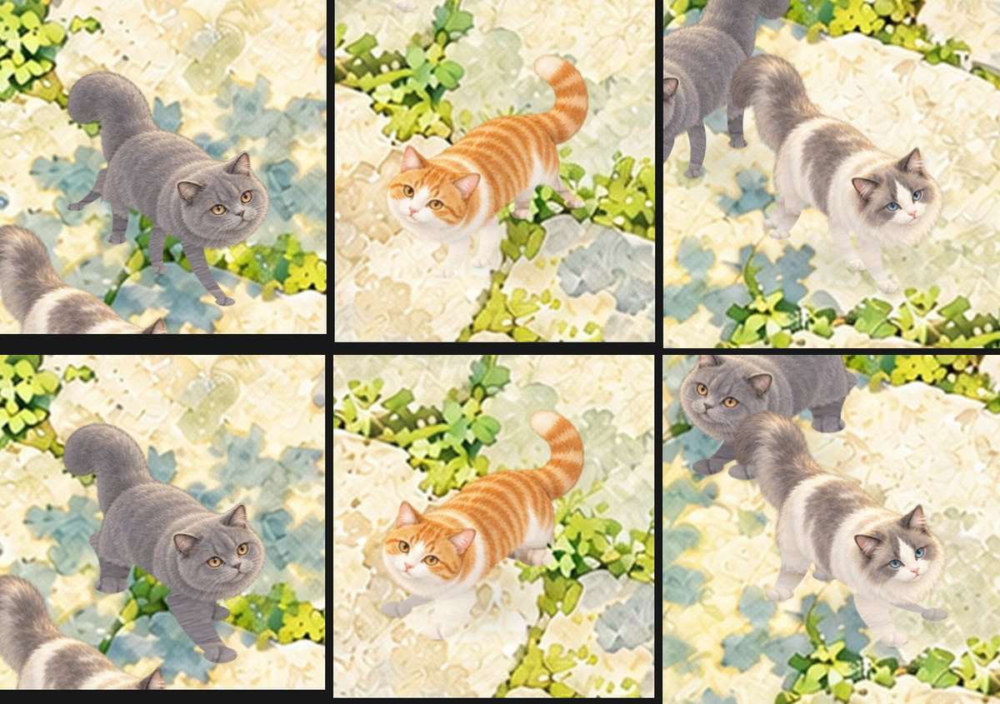

现在的走路（英短朝右、橘白朝左）：

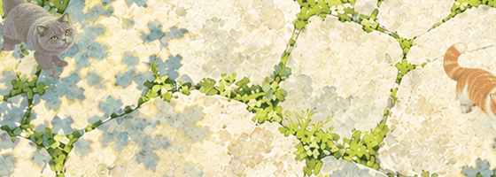

原画里远侧前腿的实际位置（红线为近侧前腿，远侧前腿在它左上方、脸颊下面）：

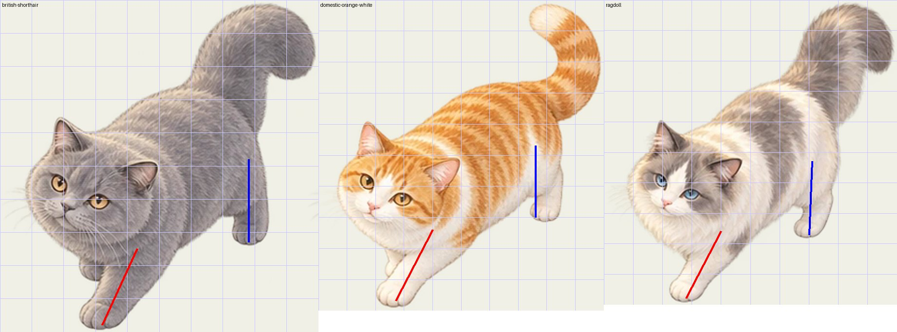

---

## 2. 重绘上下台阶的跳跃

**原来**：跳的时候猫一直保持“站着走路”的姿势，四条腿一起往上缩，整只猫平移上浮再落下，看起来像“悬浮”而不是“跳”。而且不管高差多少都一样跳：木廊到草垫只差两三厘米，也要完整蹲下起跳一次，节奏很怪。

原来的样子（上台阶时，背面）：

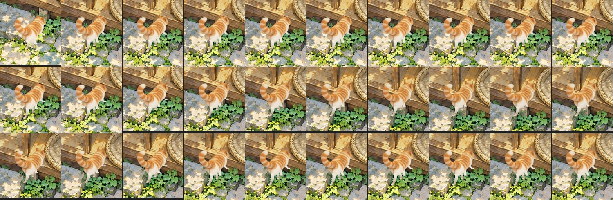

**现在**：按真实猫跳台阶的动作重新做了一套「跳跃姿态」，所有 16 款猫共用：

1. **蓄力**：身体下沉、略压扁，四爪踩稳，上跳时后半身先压低。
2. **蹬地**：后腿向后伸直发力，前腿收到胸前，上跳时抬头。
3. **腾空**：身体略拉长，前腿向前伸去够落点，后腿收起；下跳时低头探爪。
4. **着地**：前爪先落地承重，后爪随后落下。
5. **缓冲**：身体下沉一下再站直，接着继续走。

弹道也改了：上跳在后半段才到最高点（要越过更高的边沿），下跳一出发就到顶然后落下；水平方向匀速前进，起跳和落地不再“停在空中”。

**按高差分三档**（用原画里各表面的实际高度判断）：

| 高差 | 例子 | 动作 |
|---|---|---|
| 很低（< 5） | 木廊 ↔ 草垫边沿 ↔ 草垫 | 直接迈过去，不停顿、不下蹲 |
| 较小（5–11） | 石阶 ↔ 木廊、草地 ↔ 暖石 | 轻跳：动作幅度约一半、更快 |
| 真正的台阶（≥ 11） | 石板地 ↔ 石阶 | 完整起跳 |
| 爬架 | 地面 ↔ 低平台 | 大跳，幅度最大 |

现在的上台阶（背面）与下台阶（正面）：

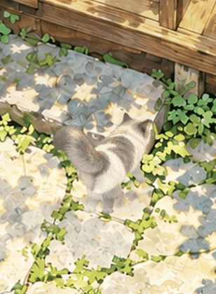 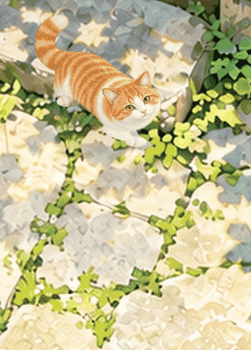

关键帧（从左到右：蓄力 → 蹬地 → 腾空 → 着地 → 缓冲）：

上台阶：
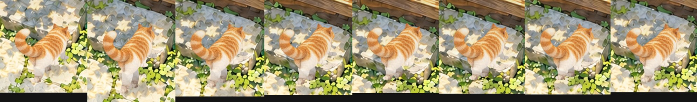

下台阶：
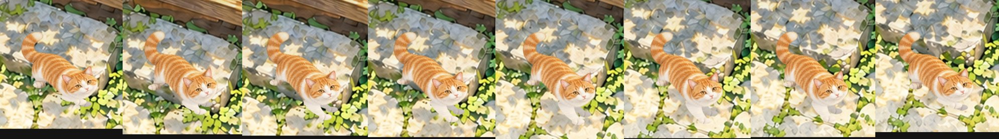

跳上爬架低平台：
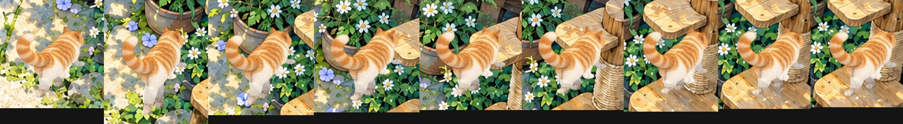

---

## 3. 树下的遮挡关系

**原来**：左上角的树冠是一整层画在所有猫上面的，猫走到树下就被叶子整只盖住，看不见、也点不中。

**原因**：树冠在高处，猫在地上。从这个俯视角度看，树下的猫应该是“透过枝叶看得见”的，而不是被一堵叶子墙挡住。

**现在**：

- 猫走到树冠下时，盖在猫身上的那一小块叶子会柔和地变淡（中心约剩两成），边缘渐隐，像透过枝叶的缝隙看到它。树冠其余部分完全不变。
- 原来的树荫斑驳光照保留：树下的猫依然更暗一些，所以仍然看得出“在树下”。
- 只重画猫身上的那一小块，不重画整片树冠，多只猫靠在一起时也只处理一次。
- 树下的猫现在也能直接点中、轻抚。

左边原来（布偶在树下完全看不见），右边现在：

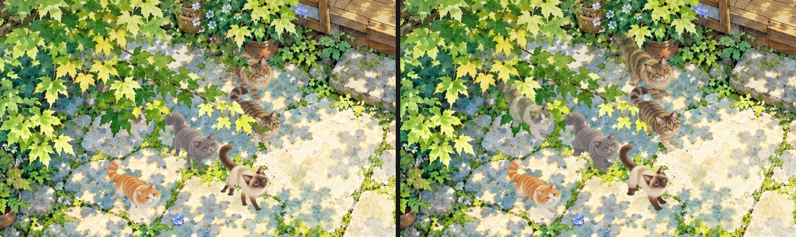

春天樱花、秋天枫叶下同样有效：

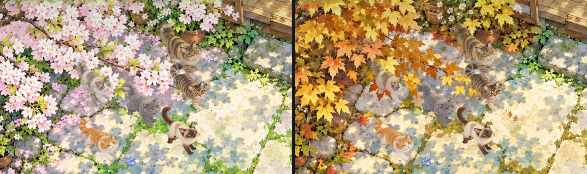

---

## 4. 石阶堵车（巡检发现）

**原来**：石阶是上木廊、回草垫猫窝、去水碗的唯一通道。只要有一只猫在石阶上停下来（比如点了「石阶上看看庭院」），后面的猫就全部堵在台阶下，30 秒、几分钟都不动。实测 8 只猫时，要回窝的两只和要喝水的一只全挤成一团。

还有一种情况是两只猫都差几毫米到位置，被对方的“个人空间”推开，互相等待。

**现在**：

- 停在通道上的空闲猫（在看、在舔毛、在发呆）会主动侧身让开到旁边，过一会儿再继续原来的状态。
- 离目的地只差几毫米、又被旁边的猫挡住时，直接算到达（喂食位和猫窝睡位仍要求精确对位）。
- 让路的猫只在当前这一层表面上挪动，不会为了让路去跳台阶。

左边原来（30 秒后仍堵在台阶下），右边现在（同样 8 只猫、同样指令，30 秒内两只已经睡进草垫，喝水的猫已上木廊）：

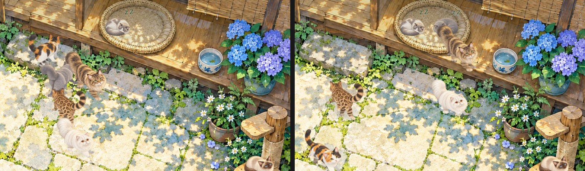

## 5. 窄处顶牛（巡检发现）

**原来**：两只都有目的地的猫在木廊、窝边这种窄处迎面相遇，会一直互相等；闲逛的猫在台阶边等对方让出落点时也会一直等。还有一种：猫被旁边的猫挤到石阶的角上，剩下的路正好擦过台阶侧面，既走不过去也跳不上去，就原地卡死。

**现在**：

- 两只都“有事要办”的猫顶牛 3 秒后，优先级低的一只先侧身让开，让完后**继续原来的目的地**（回窝、去水碗、去爬架、玩玩具都会接着做）。
- 只是在闲逛的猫，等太久就放弃这次散步，换别的事做。
- 起跳前判断“落点有没有被占”只看真正站在那里（或正落向那里）的猫，不再被别的猫“打算以后去”的位置挡住。
- 木廊太窄让不开时，让路的猫可以先站近一点，实在不行再跳下到庭院里让开。
- 被挤到台阶角上、4 秒没挪动的猫，会先退回同一层的空地，再重新规划路线。

压力测试（同一份脚本、同样的随机种子，分别跑 GitHub 上的 V3.0 原版和现在的 3.1；每次模拟 3 分钟，期间每 20 秒随机让一只猫去草垫/暖石/石阶/水碗/爬架/晒太阳；统计“有路要走却原地不动”的最长时间）：

| 场景 | 原来 3.0 | 现在 3.1 |
|---|---|---|
| 8 只猫，6 组种子 | 6 组全部卡住 ≥12 秒，最长 **127 秒** | 0 组，最长 4.5 秒 |
| 12 只猫，3 组种子 | 3 组全部卡住，最长 **145.5 秒** | 0 组，最长 4.5 秒 |
| 12 只猫，另 4 组种子 | 4 组全部卡住，最长 **145 秒** | 0 组，最长 7 秒 |

剩下的几秒是正常的“等前面的猫走开 / 让路”过程。

复现：`node scripts/cat-traffic-stress.mjs 12 4 3 20`（参数依次为猫数、种子组数、每组分钟、起始种子）。

---

## 6. 玩具朝向（巡检发现）

**原来**：玩毛线球、玩具小鼠时，猫走到玩具附近随便一个位置就开始扑，经常背对玩具扑空气；用猫抓板时伸懒腰的方向背对抓板。

**现在**：猫会走到玩具的左边或右边（优先从它来的那一侧），面朝玩具；扑、伸懒腰时前爪正好落在玩具上。毛线球、小鼠被拍走后，猫会重新站到新位置旁边。逗猫棒同理。

左边原来，右边现在（每列依次为毛线球、猫抓板、玩具小鼠）：

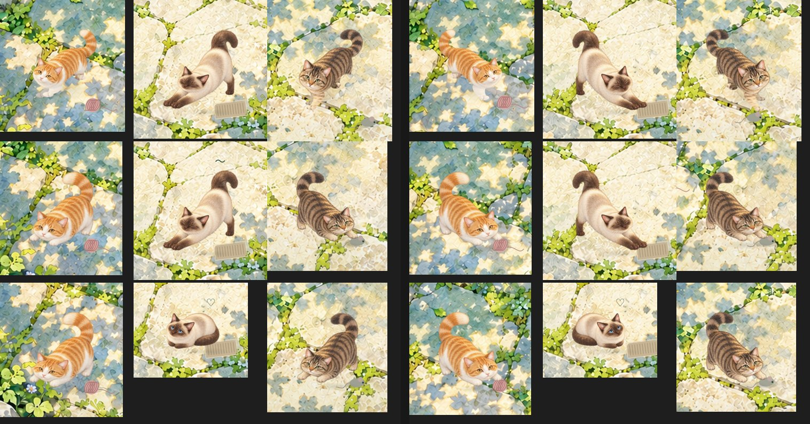

---

## 7–8. 其他

- **树下的猫能点中**：原来点击树叶覆盖处会直接忽略猫，现在猫看得见就点得中。
- **减少动态**：开启「减少动态」或节能画质时，跳跃的下蹲、抬头、伸腿幅度减半，但仍保留“蓄力—跳—落地”的完整过程。

---

## 验证

**逻辑测试**：`pnpm test` 全部通过，**416 项**（原 407 项 + 新增 9 项）。新增覆盖：

- 远侧前/后腿位于近侧腿上方靠头一侧，不会再落到身体中段；16 款腿粗都在原画测量范围内。
- 跳跃姿态：蓄力下沉、蹬地抬头、后腿后伸、前腿收起再前伸、前爪先着地；下跳低头；轻跳幅度小于完整起跳；低沿迈步不腾空。
- 高差分档、上跳晚到顶/下跳早到顶、腾空水平方向不停顿、蓄力到起跳没有跳变。
- 石阶上有猫停留时，回窝和喝水的猫都能到达。
- 随机繁忙庭院中没有猫带着目的地原地卡住超过 12 秒。
- 毛线球、猫抓板、小鼠：猫面朝玩具，前爪够得到。
- 树冠透叶窗口合并后不会重复绘制。

原有测试中有 4 项是按“旧跳法”写的（固定跳高 > 0.018、下蹲 ≤ 2.4%），已按新的分档规则改写，保留原有的安全检查（落点合法、不跳到别的猫身上、存档不保存半空位置、跳跃中换指令落地后执行等）。

**画面检查**（无头 Chromium，1600×900，2–3 倍像素截图逐帧查看）：

- 16 款中的布偶、英短、橘白、狸花、暹罗走路四个方向逐帧检查。
- 石板地 ↔ 石阶 ↔ 木廊 ↔ 草垫、草地 ↔ 暖石、地面 ↔ 爬架的上跳和下跳关键帧。
- 夏、春、秋树下遮挡；冬夜、秋日整体画面；390×844 窄窗口。
- 6 种道具同时使用。
- `pnpm build` 构建通过。

## 没有做到 / 需要你在 Mac 上跑的

- **macOS 正式包没有重新打**。我这边的运行环境是 Linux，没法编译 macOS 原生模块和打 `.app`。在你的 Mac 上项目目录里运行：

  ```sh
  pnpm package:mac
  ```

  就会生成 3.1.0 的 `release/mac-arm64/浮生锦鲤池.app`。打包前请先退出正在运行的旧版。

- 画面检查用的是 Chromium 无头浏览器（软件渲染），不是 Electron 正式包，也没有在真机上测帧率。树下透叶只重画猫身上的小块，理论上开销很小，但 4K 满屏 12 只猫的帧率需要在你的 Mac 上看一眼。
- 动作仍然是在手绘原画上做的二维关节动画（不是三维模型），跳跃姿态是程序生成的关节变化，没有新增手绘帧。
- 截图和测试过程文件在 `work/cats/qa-3.1/`（不随源码发布），不需要可以整个删掉。

## 改动的文件

| 文件 | 改了什么 |
|---|---|
| `src/themes/cats/quadruped.js` | 远侧腿位置、按原画测量的腿粗、远侧腿压暗；新的跳跃姿态（蓄力/蹬地/腾空/着地/缓冲）与身体变换 |
| `src/themes/cats/traversal.js` | 按高差分「迈过 / 轻跳 / 起跳」三档，新弹道与节奏 |
| `src/themes/cats/game.js` | 跳跃计时、迈步不停顿；让路、顶牛绕行后继续原目的地、闲逛放弃、台阶角脱困；落点只看真实占位；玩具停靠与朝向 |
| `src/themes/cats/animation.js` | 迈过低沿时保持走路动作，跳跃时把档位和方向传给姿态 |
| `src/themes/cats/renderer.js` | 树下透叶窗口；树下的猫可点击 |
| `src/themes/cats/canopy-windows.js` | 新增：透叶窗口合并 |
| `tests/cats-courtyard-3.1.test.js` | 新增 7 项测试 |
| `tests/cats-quadruped.test.js`、`tests/cats-step-traversal.test.js` | 按新跳法改写 4 项、新增 2 项 |
| `scripts/cat-traffic-stress.mjs` | 新增：通行压力测试脚本 |
| `package.json`、`README.md` | 版本 3.1.0 与更新说明 |
