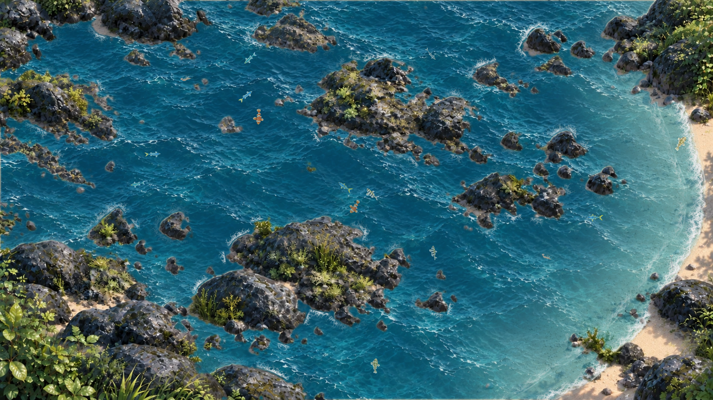
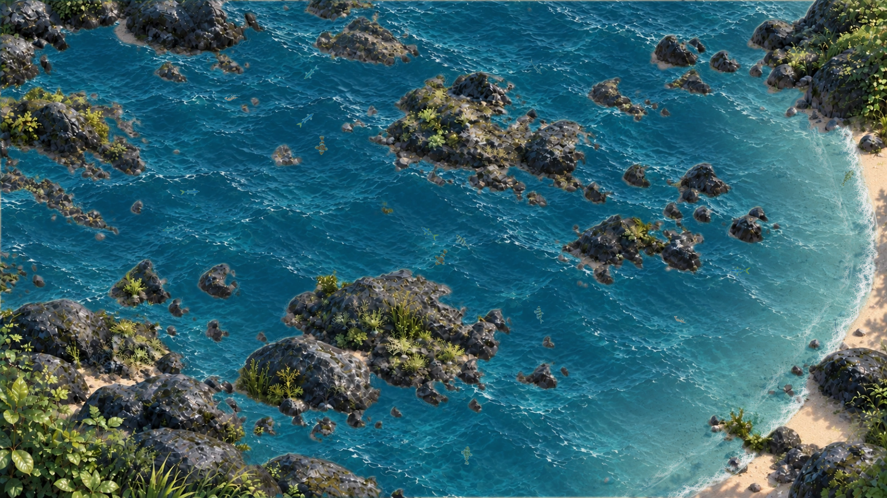
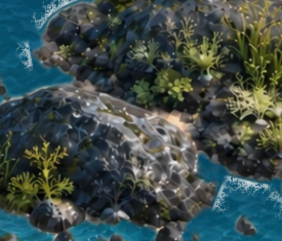
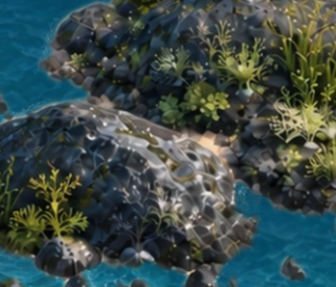

# v4.2 · 水下鱼群与礁边轻浪

应用版本：**4.2.0**。本次只调整赶海主题的水下表现、鱼的尾摆、礁石接缝和漂流瓶到达机制；主 UI、潮汐与其他三个主题不变。沿用原存档键和收藏。

## 改动

- **鱼游在水下**：原来水面绘制在鱼之前，现在将同一动态水面分成前后两层。按水深吸收暖色和亮鳞反光，保留花纹与小丑鱼的橙色；鱼的投影尺寸、位置、朝向、命中和行为不变。
- **连续游姿**：在现有 32 帧缓存之间做预乘 alpha 插值，尾摆连续过渡；没有增加新行为或改变礁石避障路线。
- **自然岩缘**：从现有岩面 alpha 提取接触轮廓，增加贴岩湿边、缓慢推进并消散的断续细泡沫。去除大块方形泡沫贴片与闭合光圈；干地受潮位遮罩保护。轮廓仅供光学渲染，不更改碰撞。
- **更常见的漂流瓶**：没有待拾取来信时，约 4–6 分钟活跃等待后漂来一封；拾取后重新计时。暂停、隐藏窗口、切换主题及关闭不累积等待，切潮不连发。首封仍保留真实涨潮时的到访。
- **来信航路修复**：新礁石曾把旧固定入口与岸边目标隔开，导致无法生成来信。现在优先原入口，无法连通时从目标所在海域的安全上游水面淡入，按原足迹检查漂行；岩面异步加载后重验在途路线，保留瓶子和信件身份。29 封不重复内容、寄信和收藏规则保留。

## 文件

| 文件 | 用途 |
| --- | --- |
| `src/themes/coast/animal-renderer.js` | 连续鱼姿与水下深度光学 |
| `src/themes/coast/art-materials.js` | 鱼类水下透射材质，保留 alpha |
| `src/themes/coast/renderer.js`、`water.js` | 鱼身上方同相水纹，保持潮位裁切 |
| `src/themes/coast/rock-contact.js`、`contact-contours.js`、`material-foam.js`、`foam-material.js` | 真实岩缘、断续泡沫和批量绘制 |
| `src/themes/coast/bottles.js` | 活跃等待、路线连通性与岩面加载后修复 |
| `tests/coast-*.test.js` | 对应计时、兼容、轮廓、帧插值回归 |
| `package.json`、`src/components/SettingsPanel.jsx`、`README.md` | 4.2.0 版本号及说明 |

复用已有图片，未烘焙假鱼、替换背景或添加全屏滤镜。瓶子存档只补 `arrivalScheduleVersion` 识别旧的未使用倒计时，保留 `mofish-bottles-v1` 和已有数据。

## 验证

- 完整自动化测试 **510 项通过**，Electron 安全/桌面策略测试 **5 项通过**；批处理优化后再次通过 9 项接缝与潮位渲染测试。
- 相同 1600 × 900、DPR 1、晴天白昼条件，低/中/高潮各 0、2、4 秒，共 9 帧前后对比；资源和 JavaScript 无报错。固定鱼位置只用于画面对比，低潮对比图不用于判定实际迁移。
- 五个潮位的水线/岸线坐标与 v4.1 完全一致；实际鼠标观察、三次间隔捕捉、冷却、入桶、图鉴和重启恢复通过。
- 自然生成的漂流瓶可以按可见位置点击读信，收藏重启保留。真实岩面 20 个种子 × 3 个潮位共 **60 组**生成、漂到、拾取及寄出通过；另 **20 组**晚加载岩面重规划通过。
- 银鱼、小丑鱼、河豚各 240 个动画采样，旧版各 207 次重复帧，新版为 0；主体 alpha 稳定，14 条鱼的中心命中通过。
- 本机 1600 × 900、DPR 2、30 个场景实体、原生 RAF 的 10 秒样本约 **59.37 FPS**，绘制 CPU p95 **8.9 ms**。接缝绘制从第一版约 8.75 ms/帧降到 2.77 ms/帧；不是跨设备性能保证。
- 生产构建及实际 macOS arm64 安装包通过：四主题打开、4.2.0 版本显示、主题重载、原生桌面层、鼠标穿透和恢复控制；沙箱/上下文隔离保持开启，`codesign --verify --deep --strict` 校验通过。继续保留已有大于 500 KB 的入口 chunk 提示。

## 同状态对比

修改前：

修改后：

礁石接缝近景：

验证 JSON 在 `docs/verification/v4.2/`。测试均使用隔离存档，没有清空用户数据。

## 已知范围

本次打包验收遇到一次外部 Open-Meteo 天气请求失败；本地场景无资源错误，已有天气回退仍工作，未在本次修改天气服务。

本次是现有 Canvas 分层画面的光学改进，不是完整物理流体或 3D 引擎。Windows / Linux 原生桌面能力及 Apple 公证不在本次范围；macOS 包继续为 arm64、ad-hoc 签名，未 Apple 公证。
